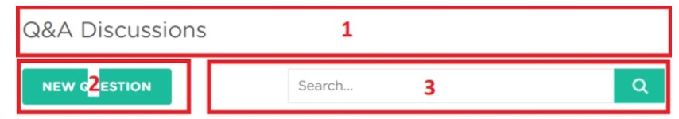
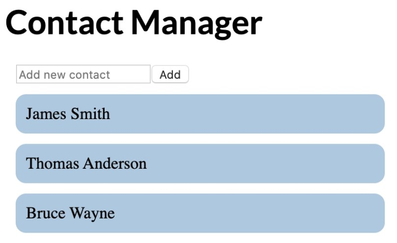

# React 🚀️

Apuntes basados en SoloLearn.

## ¿Qué es el desarrollo Front-End?

Se refiere al desarrollo de lo que el usuario final (cliente) va a ver. Consiste, básicamente, en HTML, CSS y JS. Como desarrolladores, somos consientes que a medida que las paginas van creciendo, se van haciendo cada vez mas complejas, y para manejar estas necesidades, se crearon librerías como React.

React fue creada por Facebook en 2013.

## ¿Porque React?

**Velocidad**

Las web interactivas necesitan actualizar el DOM casi siempre cada vez que cambia algo, React usa un **DOM Virtual** que permite hacer el update solo en las partes de la web que son necesarias. Esto aumenta mucho la velocidad de actualización.

**Fácil de usar**

Hace que mantener aplicaciones complejas sea mucho mas fácil.

**Support**

Hay mucha comunidad atrás de este lenguaje. Esta mantenido por Facebook y su comunidad.

# Getting Started ❤️

### Agregar React al HTML

Primero, tenemos que agregar a React en la etiqueta `<head>` de nuestro HTML.

```html
<script src="https://unpkg.com/react@16/umd/react.development.js" crossorigin></script>

 <script src="https://unpkg.com/react-dom@16/umd/react-dom.development.js" crossorigin></script>
```

También tenemos que agregar otro Script para permitir el **uso de JSX** , esta es una extensión de JS.

```html
<script src="https://unpkg.com/babel-standalone@6/babel.min.js"></script>
```

Creamos el container `<div id="container"></div>` y mostramos el primer mensaje hecho con React

```javascript
<script type="text/babel">
ReactDOM.render(
  <h1>Hello, React!</h1>,
  document.getElementById('container')
) 
</script>
```

Este Script busca el div con el ID 'Container' y le agrega el `<h1>`

### Crear una Aplicación React

En este caso, vamos a necesitar Node para crear un proyecto React. Vamos a crear una aplicación llamada "my-app"

```
npx create-react-app my-app
cd my-app
npm start
```

### Estructura del proyecto

* public -> Contiene todo lo que la aplicacion va a mostrar al cliente, como el `index.html` que es el template de nuestra pagina.
* src -> Contiene todo el JS, CSS e imagenes que van a ser compilados en el `index.html`

**¿Cómo se compila todo dentro de un solo archivo bundle?**
Se usa un **File Loader**. En el caso de React, se usa **Webpack**, crea un bundle que contiene a todos los archivos que necesitan ser "bundleados", creando un solo HTML con todo.

* index.js -> Es el entrypoint de la aplicacion, tiene un metodo llamado `ReactDOM.render()` que busca al elemento cuyo id es "root" en el HTML e inserta todo el contenido ahi.
* App.js -> Es el componente main de la aplicacion que sera renderizado en el DOM.

Para cambiar el texto que nos viene de bienvenida al crear el proyecto, tenemos que ir al archivo `src/index.js`, por ejemplo, con lo siguiente ->

```javascript
ReactDOM.render(
  <h1>Hello, React!</h1>,
  document.getElementById('root')
);
```

# JSX ❤️

### ¿Qué es JSX?

Es una extension de Javascript que nos permite construir elementos de la UI usando codigo HTML pero en el medio del JS. No es obligatorio usarlo, pero si muy comun.
Por ejemplo ->

```
ReactDOM.render(
  <h1>Hello, React!</h1>,
  document.getElementById('root')
);
```

Esta porcion de codigo llamada al metodo `Render` de React, y le pasa dos argumentos, el elemento HTML que queremos renderizar y el container del mismo (El elemento cuyo id es root).
Tambien nos podemos manejar con variables como en el siguiente ejemplo:

```
const name = "David";
const el = <p>Hello, **{name}**</p>;

ReactDOM.render(
  el,
  document.getElementById('root')
);
```

### Atributos en JSX

Podemos usar como atributos de un HTML nombres entre comillas como `<div id="container"></div>` o usar una expresion JS `<div id={user.id}></div>`

### ¿Cómo funciona?

Cuando las expresiones JSX con compiladas, se convierten en objetos JS, que representan elementos de React, y luego estos elementos son usados para constuir el DOM para luego, mostrarlo en el navegador.

Por ejemplo, hagamos un contador que incremente el valor de una variable por segundo, y esto representa un parrafo en la pagina:

```
let counter = 0;

function show() {
  counter++;
  const el = <p>{counter}</p>;
  ReactDOM.render(
    el, document.getElementById('root')
  );
}

setInterval(show, 1000);
```

Usamos el `setInterval` para llamar a la funcion `show()` que renderiza un elemento `<p>` en la pagina con el valor del contador, que se inicializa en cero. React, al solo actualizar lo necesario, no hace un parrafo nuevo por segundo, si no que actualiza el existente.

## Virtual DOM

Para que React pueda actualizar solo lo necesario de una pagina, se usa el **Virtual DOM** que es una representacion del DOM. Cuando un elemento cambia, primero se actualiza el VDOM, esto es un proceso muy rapido. Luego, React compara al VDOM con el estado anterior y solo aplica los cambios necesarios para que el DOM ya este en el estado actual.

# Componentes 👀️

Los componentes nos permiten separar la pagina en distintas partes reusables. Por ejemplo:



Cada parte numerada es un componente separado. Esto nos permite hacer **Separation of concerns**, un principio en programacion que dice que cada problema debe ser separado en piezas individuales.

### Componentes de Función

Es una funcion de JS

```
function Hello(){
return <h1>Hola</h1>;
}
```

* Los nombres de estos componentes deben empezar con mayuscula, de lo contrario, el navegador los va a tratar como elementos html.

**¿Cómo lo renderizo?**

Tenemos que crear el elemento JSX correspondiente
`const el = <Hello/>`

Ahora podemos usar nuestro componente y renderizarlo:

```
function Hello() {
  return <h1>Hello world.</h1>;
}

const el = <Hello />; 
ReactDOM.render(
  el, 
  document.getElementById('root')
);
```

### Componentes de clase

Son usados cuando hay interacciones con el usuario mas avanzadas, como formularios o animaciones.
Todos necesitan heredar de React.Component

```
class Hello extends React.Component {
  render() {
    return <h1>Hello world.</h1>;
  }
}
```

# Props 👀️

Los componentes de Funcion pueden aceptar argumentos, como las funciones de JS. A estas se le dicen `props` y representan a un objeto.
Por ejemplo, si queremos usar props en nuestro componente `Hello` ->

```
function Hello(props) {
  return <p>Hello, {props.name}!</p>;
}
```

Y asi, luego, se lo podemos mandar
`const el = <Hello name="David" />;`

Los componentes pueden usar a otros componentes para generar un output, por ejemplo:

```
function App() {
  return <div>
    <Hello name="David" />
    <Hello name="James" />
    <Hello name="Amy" />
  </div>;
}
```

El codigo anterior, llama al componente Hello pero con distintos nombres.
En los **componentes de clase** los props pueden ser accedidos de la siguiente manera:

```
class Hello extends React.Component {
  render() {
    return <p>Hello, {this.props.name}!</p>;
  }
}
```

Ahora, por ejemplo, creemos una lista de compras.
Cada item va a tener un nombre y un precio -> `<Item name="Cheese" price="4.99" />`
El componente item va a renderizar lo siguiente ->

```
function Item(props) {
  return <div className="item">
  <b>Name:</b> {props.name} <br />
  <b>Price:</b> {props.price}
  </div>;
}
```

Ahora podemos usar el componente y renderizar varios items ->

```
<Item name="Cheese" price="4.99" />
<Item name="Bread" price="1.5" />
<Item name="Ice cream" price="24" />
```

# States 🚀️

State es un objeto que es agregado como propiedad en los **componentes de clase**

```
class Hello extends React.Component {
  state = {
    name: "James"
  }
  render() {
    return <h1>Hello {this.state.name}.</h1>;
  }
}
```

Al igual que las props, los state pueden ser accedidos medianrte `this.state...`. Cuando el componente se renderiza, el valor de, en este caso, 'name' se va a inicializar con James.
El `state` no puede ser modificado de forma directa. React te da un metodo `setState()` para esto.

```javascript
this.setState({ 
  name: "James",
  age: 25
});
```

Cuando `setState` es llamado, el componente se vuelve a renderizar automaticamente para que muestre el nuevo estado.

**Counter App**

Vamos a crear una aplicacion que incremente al counter cada vez que se toca al boton.
Hacemos el componente **Counter** con un counter y un boton.

```javascript
class Counter extends React.Component {
  state = {
    counter: 0
  }
  render() {
    return <div>
    <p>{this.state.counter}</p>
    <button>Increment</button>
    </div>;
  }
}
```

Vamos a inicializar el state en 0. Ahora hacemos un evento para handlear al click en el boton.

```
class Counter extends React.Component {
  state = {
    counter: 0
  }
  increment = () => {
   this.setState({
     counter: this.state.counter+1});
  }
  render() {
    return <div>
    <p>{this.state.counter}</p>
    <button **onClick={this.increment}**>Increment</button>
    </div>;
  }
}
```

El `onClick` va a llamar a la funcion `increment()` y a sumarle uno al state counter.

# Props vs State 👀️

* Usamos las props para pasar data entre componentes
* Los componentes usan los state para manejar su data
* Las props son read-only, no se pueden modificar
* Los State pueden ser modificados usando `setState()`
* El `setState()` renderiza de vuelta al componente
* Los componentes con state se llaman `stateful`, y los que no, `stateless`

# Hooks 🚀️

Las versiones mas viejas de React permitian usar los state solo con componentes de clase. Hace poco aparecieron los **Hooks**, que permiten usar los state dentro de componentes funcionales.
Importamos la libreria ->
`import React, { useState } from 'react';`
Y asi lo manejamos ->

```
function Hello() {
  const [name, setName] = useState("David");

  return <h1>Hello {name}.</h1>;
}
```

En el ejemplo, creamos el state 'name' y creamos el 'setName', que seria como el 'setState'.
Aca podemos ver como se usa con la aplicacion del contador ->

```
function Counter() {
  const [counter, setCounter] = useState(0);

  function increment() {
    setCounter(counter+1);
  }

  return <div>
  <p>{counter}</p>
  <button onClick={increment}>
    Increment
  </button>
  </div>;
}
```

Los hooks solo pueden ser usados dentro de un componente funcional.

# Ciclos de Vida 🎉️

React da metodos especificos para los ciclos de vida para los componentes de clase. Se llaman cuando el componente se monta, actualiza o desmonta.

* Montar -> El componente se renderiza en la pagina
* Desmontar -> El componente es removido de la pagina

**componentDidMount()**
Es llamado cuando el componente es **renderizado** es la pagina.  Se puede usar para inicializar cosas.

```
componentDidMount() {
  this.setState({counter: 42});
}
```

**componentWillUnmount()**
Es llamado antes de que el componente vaya a ser desmontado del DOM. Se puede usar para librerar resources.

**componentDidUpdate**
Se llama cuando el componente se actualiza en el DOM. Podemos hacerlo, por ejemplo, para avisar cada vez que el counter se incrementa.

```javascript
componentDidUpdate() {
alert("Number of clicks: " + this.state.counter);
}
```

**useEffect()**
Lo importamos ->
`import React, { useState, useEffect } from 'react';`

Es un hook para los componentes funcionales. Combina los metodos anteriores en uno. Por ejemplo, en el caso del contador ->

```
function Counter() {
  const [counter, setCounter] = useState(0);

  useEffect(() => {
    alert("Number of clicks: " + counter);
  });

  function increment() {
    setCounter(counter+1);
  }
  return <div>
  <p>{counter}</p>
  <button onClick={increment}>Increment</button>
  </div>;
}
```

En este caso, va a correr cuando el componente se monte y se actualice. Si queremos que corra solo ante el update del componente, agregamos lo siguiente:

```
useEffect(() => {
  //do something
}, [count]);
```

Y si queremos un **componentWillUnmount**, useEffect puede devolver una funcion que "limpie" lo necesario

```
useEffect(() => {
  // do something
  
  return () => {
    // cleanup
  }; 
});
```

Se pueden tener varios Effects en un solo componente.

# Eventos 🚀️

Por ejemplo, si queremos agregarle un evento al hacer click en un boton, tendriamos que setear primero el onClick del mismo ->

```javascript
<button onClick={handleClick}>
  My Button
</button>
```

En el caso del contador, al apretar el boton, llamariamos a la funcion `increment()`

```
function Counter() {
 const [counter, setCounter] = useState(0);

 function increment() {
   setCounter(counter+1);
 }
 return <div>
 <p>{counter}</p>
 <button onClick={increment}>Increment</button>
 </div>;
}
```

La funcion `increment()` va a llamar al `setCounter()` para cambiar el estado de la variable del state `counter`

### User Inputs

Podemos manejar los inputs del usuario mediante el `onChange()` en el ingreso de texto. Por ejemplo, si hacemos una app que cambie de km a millas, tendriamos que hacer algo asi ->

```
function Converter() {
  const [km, setKm] = useState(0);

  function handleChange(e) {
    setKm(e.target.value);
  }
  function convert(km) {
    return (km/1.609).toFixed(2);
  }

  return <div>
  <input type="text" value={km}
     onChange={handleChange} />
  <p> {km} km is {convert(km)} miles </p>
  </div>;
}
```

`handleChange()` actualiza el state con el valor actual que el usuario ingreso en el cuadro de texto, para esto, el componente debe renderizarse de vuelta para mostrar el valor correspondiente que es calculado con la funcion `convert()`.

## Formularios ❤️

Por ejemplo, queremos hacer un fomrulario que tenga 1 input de un numero y un submit, y que por cada submit, el numero escrito se vaya sumando con los anteriores a medida que hacemos submit.

```javascript
function AddForm() {
  const [sum, setSum] = useState(0);
  const [num, setNum] = useState(0);

  function handleChange(e) {
    setNum(e.target.value);
  }

  function handleSubmit(e) {
    setSum(sum + Number(num));
    e.preventDefault(); //Hace que la pagina no haga reload al hacer el submit
  }

  return <form onSubmit={handleSubmit}>
  <input type="number" value={num} onChange={handleChange} />
  <input type="submit" value="Add" />
  <p> Sum is {sum} </p>
  </form>;
}
```

### Listas

Tenemos el siguiente array de Strings -> `const arr = ["A", "B", "C"];`
Y necesitamos renderizar un `<li>` por cada elemento del array. Definimos un componente llamado `MyList` y le pasamos al array como prop -> `<MyList data={arr} />`
Ahora, como podemos acceder al array mediante las props, hacemos la logica ->

```
function MyList(props) {
  const arr = props.data;
  const listItems = arr.map((val) =>
    <li>{val}</li>
  );
  return <ul>{listItems}</ul>;
}
```

Loopeamos entre los valores del array recibido y hacemos un elemento `<li>` por cada elemento de la lista. Luego de todo este proceso, se devuelven estos elementos envueltos en un `<ul>`

### Keys

Cada elemento en una lista debe tener una `key`, este actua como un identificador unico por elemento. Pueden salir de tu misma data o ser autogenerados.

```
const listItems = arr.map((val, index) =>
  <li key={index}>{val}</li>
);
```

# Manager de Contactos ❤️

El mockup es el siguiente ->


Podemos ver en principio que necesitamos 2 componentes:

* AddPersonForm -> El escribir y agregar al contacto
* PeopleList -> Ver lista de contactos

**AddPersonForm**

```
function AddPersonForm() {
  const [ person, setPerson ] = useState("");

  function handleChange(e) {
    setPerson(e.target.value);
  }

  function handleSubmit(e) {
    e.preventDefault();
  }
  return (
    <form onSubmit={handleSubmit}>
    <input type="text" 
    placeholder="Add new contact" 
    onChange={handleChange} 
    value={person} />
    <button type="submit">Add</button>
    </form>
    );
}
```

**PeopleList**

```
function PeopleList(props) {
  const arr = props.data;
  const listItems = arr.map((val, index) =>
    <li key={index}>{val}</li>
  );
  return <ul>{listItems}</ul>;
}
```

**Renderizamos a los componentes e inicializamos data**

```
const contacts = ["James Smith", "Thomas Anderson", "Bruce Wayne"];

const el = (
  <div>
    <AddPersonForm />
    <PeopleList data={contacts} />
  </div>
);
```

## Compartiendo States

Si tenemos dos componentes distintos, y necesitamos que uno compara cierto state con otro, debemos entonces crear un componente padre que contenga la data que necesita ser compartida entre componentes.

**Nuevo Componente ContactManager**

```javascript
function ContactManager(props) {
  const [contacts, setContacts] = useState(props.data);

  return (
    <div>
      <AddPersonForm />
      <PeopleList data={contacts} />
    </div>
  );
}
```

ContactManager recibe los contactos por props, los guarda en su state y se los pasa al componente hijo.
**El padre puede pasarle data al hijo, pero el hijo no le puede pasar data al padre**

### Agregando un contacto

Creamos un metodo `addPerson()` en nuestro componente `ContactManager`

```javascript
function ContactManager(props) {
  const [contacts, setContacts] = useState(props.data);

  function addPerson(name) {
    setContacts([...contacts, name]);
  }
 ...
}
```

¿Cómo llamamos a esta funcion desde nuestro componente hijo (`AddPersonForm`)? Pasando la misma tambien como prop

```
function ContactManager(props) {
  const [contacts, setContacts] = useState(props.data);

  function addPerson(name) {
    setContacts([...contacts, name]);
  }

  return (
    <div>
      <AddPersonForm handleSubmit={addPerson} />
      <PeopleList data={contacts} />
    </div>
  );
}
```

Se lo pasamos utilizando el `handleSubmit`, y ahora,  `AddPersonForm` puede utilizar esta funcion.

```javascript
function AddPersonForm(props) {
  const [ person, setPerson ] = useState('');
    
  function handleChange(e) {
    setPerson(e.target.value);
  }
    
  function handleSubmit(e) {
    props.handleSubmit(person);
    setPerson('');
    e.preventDefault();
  }
  return (
    <form onSubmit={handleSubmit}>
      <input type="text" 
        placeholder="Add new contact" 
        onChange={handleChange} 
        value={person} />
      <button type="submit">Add</button>
    </form>
  );
}
```

# Redux 🚀️

Hasta ahora pasabamos elementos por los `state` entre padre e hijo.
**Redux** es una libreria de JS que puede ser usado con cualquier libreria de front-end, como Angular, React y JQuery.
Sigue el principio de **Sigle Source of Truth**, es relocalizar todos los state y la logica por fuera de la app, para que cualquier componente acceda a lo que necesite.

### Store

En Redux, el state se guarda como un objeto, llamado `store`. Debe haber uno solo de estos por aplicacion.

```javascript
{
  contacts: [{
    name: 'David'
  }, {
    name: 'Amy'
  }],
  toggle: true
}
```

### Actions y Reducers

Un **Action** es un objeto plano de JS

```

```

